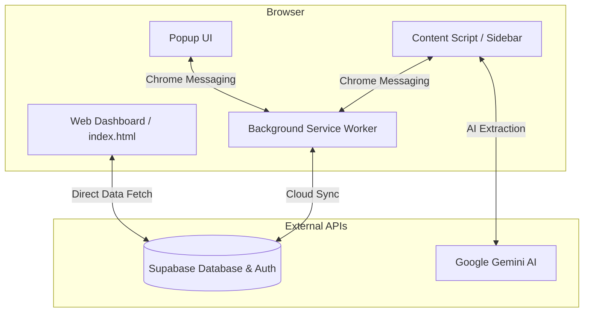

# 🛠 Job Application Tracker: Technical Overview

This document explains the architecture, components, and data flows of the **Job Application Tracker** application.

---

## 🏗 High-Level Architecture

The project consists of three main environments:
1.  **Chrome Extension (Content Scripts & Popup):** The bridge between the user's browser and the job boards.
2.  **Web Dashboard (PWA):** A full-featured application for managing, filtering, and exporting job data.
3.  **Backend Services (Supabase & Gemini):** Handles cloud synchronization, authentication, and AI-powered extraction.

---

## 🧩 Core Components

### 1. The Extension Sidebar (`src/scripts/content.js`)
*   **Role:** The primary interface for tracking jobs without leaving the job board.
*   **Injection:** Detects if it's already present and injects a 400px wide sidebar into the current page.
*   **Extraction Engine:** 
    *   **DOM Scraping:** Uses specific CSS selectors for platforms like LinkedIn, Indeed, and Naukri.
    *   **LD+JSON Parsing:** Parses structured "JobPosting" schema data if available.
    *   **Heuristics:** Analyzes page meta-tags and URL patterns for fallback data.

### 2. Background Service Worker (`src/scripts/background.js`)
*   **Role:** Handles asynchronous tasks and browser-level events.
*   **Proxy Fetching:** Solves CORS issues by proxying API requests to Supabase through the `chrome.runtime` environment.
*   **Notifications:** Uses `chrome.alarms` to schedule a "Daily Check" at 9:00 AM for scheduled interviews.
*   **Global Shortcuts:** Manages listeners for hotkeys (e.g., `Alt+Shift+E` for instant extraction).

### 3. Web Dashboard (`index.html` / `app.js`)
*   **Role:** The "Control Center" for long-term job management.
*   **Architecture:** Built as a single-page application (SPA) using vanilla JavaScript.
*   **Sync:** Real-time synchronization with Supabase ensures that a job saved via the sidebar appears instantly in the dashboard.

### 4. Resume Engine (`src/lib/resume-engine.js`)
*   **Role:** Converts plain text job descriptions and user profiles into professionally formatted DOCX files.
*   **Template Logic:** Implements a "LaTeX-Accurate" styling engine using the `docx.js` library.
*   **Optimization:** Tailors the SUMMARY, SKILLS, and EXPERIENCE sections based on the specific job data.

---

## 🔄 Key Data Flows

### A. The "Extract & Save" Flow
1.  User clicks **"Extract & Save"**.
2.  `content.js` scrapes the job description from the current page.
3.  The text is sent to the **Gemini AI API** with a custom prompt to identify `Company` and `Job Title`.
4.  Data is saved locally via `chrome.storage.local` and synced to **Supabase** via `background.js`.

### B. The Cloud Sync Flow
1.  Application data is stored in the `applications` table in Supabase.
2.  **Row Level Security (RLS):** Policies ensure that `username` (matching the Supabase User ID) is validated. Users can *only* see and edit their own data.
3.  The Dashboard and Sidebar both check for a valid `rjd_session` to authenticate these requests.

### C. The Interview Notifier
1.  `background.js` triggers an alarm once per day.
2.  It queries Supabase for jobs with `status = "Interview Scheduled"`.
3.  If any match today's date, it triggers a **Chrome System Notification**.

---

## 🔐 Security & Privacy
*   **Local-First AI:** Your Gemini API Key is stored only in **Chrome Local Storage**. It is never sent to our servers.
*   **Encrypted Sync:** All communication between the extension and Supabase is encrypted via HTTPS.
*   **Zero-Tracking:** The extension does not track browsing history; it only interacts with pages when the sidebar is actively opened or a shortcut is triggered.

---
**Version:** 1.0.0
**Status:** Production Ready
